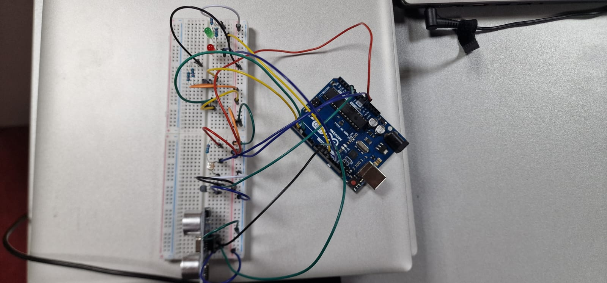

# 🔧 📟 Arduino-Based Environmental Monitoring System (Distance, Temperature, Light)

This project is a microcontroller-based implementation for a basic simulation or demonstration of a radiation detection or monitoring concept, developed as a final assignment.

## 🧠 Technologies Used

- Arduino (written in C++)
- Basic I/O components (based on project setup image)
- Serial communication for debugging/output

## 🛠 How to Run

1. Open `final.ino` in the Arduino IDE.
2. Connect the appropriate Arduino board (e.g., Uno or Nano).
3. Upload the sketch to your device.
4. Use Serial Monitor to observe output and verify behavior.
5. Refer to `image.jpg` for wiring or setup reference.

## 📷 Circuit Overview

## 📬 Author

Luka Trunić